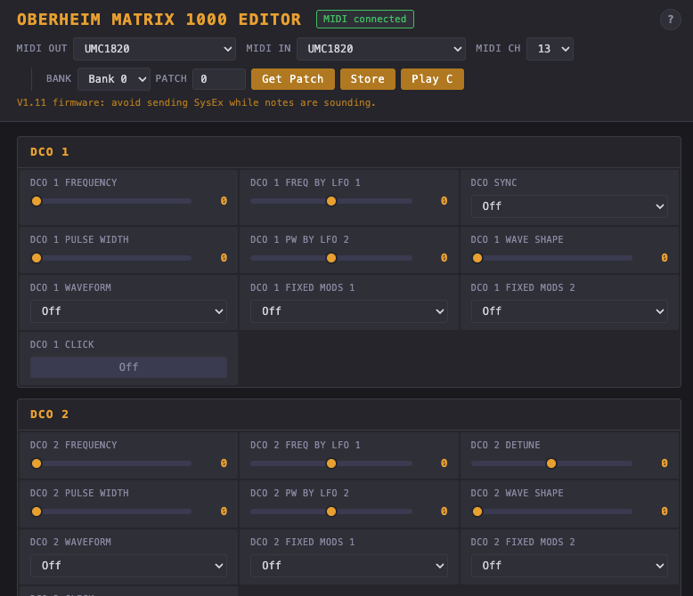

# Oberheim Matrix 1000 Editor

Browser-based real-time parameter editor for the [Oberheim Matrix 1000](https://en.wikipedia.org/wiki/Oberheim_Matrix_synthesizers#Matrix-1000) synthesizer. No installation, no backend — just open `index.html` in Chrome.



## Features

- **All 100 parameters** with sliders, dropdowns, and toggles grouped by signal flow (DCO, VCF, VCA, Envelopes, LFOs, etc.)
- **10-slot modulation matrix** editor with source/amount/destination
- **Program change** with bank select (banks 0–9, 100 patches each)
- **Get Patch** — reads the current patch from the synth into the editor (requires MIDI In connection)
- **Store** — saves the edit buffer to a user patch location (banks 0–1)
- **MIDI Monitor** — shows all incoming MIDI messages for debugging
- **Real-time editing** — slider changes are sent immediately via SysEx
- **Throttled output** — 10ms minimum gap between messages to avoid overwhelming the V1.11 CPU
- **MIDI channel selector** — switch between devices on the same interface
- **Settings persist** across sessions (MIDI ports, channel) via localStorage

## Requirements

- **Chrome** (or Chromium-based browser) — Web MIDI API with SysEx support
- **USB-MIDI interface** connected to the Matrix 1000
- **MIDI In cable** from the synth back to the interface (only needed for Get Patch)

## Usage

1. Open `index.html` in Chrome
2. Allow MIDI access when prompted (including SysEx)
3. Select your MIDI interface in the **MIDI Out** and **MIDI In** dropdowns
4. Set the correct **MIDI channel** for your Matrix 1000
5. Use **Bank** and **Patch** to select a patch (sends program change automatically)
6. Move sliders to edit parameters in real time
7. Click **Get Patch** to load the current patch into the editor
8. Click **Store** to save changes to the synth (user banks 0–1 only)

## Known Limitations

- **V1.11 firmware quirk**: sending SysEx while notes are sounding can cause audio glitches. Edit parameters in silence, then play to hear the result.
- **SysEx is not channel-aware**: Identity Request and patch dumps go to/from all devices on the interface regardless of channel setting. The channel selector affects program change and note messages only.
- **Factory presets (banks 2–9)** are protected from accidental overwrite.

## Project Structure

```
matrix1000-editor/
├── index.html           App shell
├── css/style.css        Dark synth theme
├── js/
│   ├── app.js           Entry point
│   ├── midi.js          WebMIDI management, throttled send queue
│   ├── sysex.js         SysEx message builders and patch parser
│   ├── params.js        All 100 parameter definitions
│   └── ui.js            UI rendering, controls, dialogs
├── docs/
│   └── sysex-spec.md    Matrix 1000 SysEx specification reference
├── LICENSE              MIT
└── README.md
```

## SysEx Reference

The Matrix 1000 uses Oberheim's SysEx protocol:

| Opcode | Function |
|--------|----------|
| `06H`  | Single parameter edit |
| `0BH`  | Modulation matrix path edit |
| `0AH`  | Bank select |
| `04H`  | Request patch data |
| `0CH`  | Unlock bank (required before store) |
| `0EH`  | Store edit buffer to patch |

All messages: `F0 10 06 [opcode] [data...] F7` (manufacturer `10` = Oberheim, device `06` = Matrix-6/1000).

See [docs/sysex-spec.md](docs/sysex-spec.md) for the full specification.

## Links

- [specs](http://www.youngmonkey.ca/nose/audio_tech/synth/Oberheim-Matrix1000.html)
- [Matrix review (German)](https://www.amazona.de/vintage-analog-oberheim-matrix-1000-synthesizer-1984/)

## Credits

Built with the assistance of [Claude Code](https://claude.ai/claude-code) (Anthropic).

## License

[MIT](LICENSE)
